# Xentro Architecture - Mermaid Diagrams

This document contains detailed Mermaid diagrams for visualizing the Xentro platform architecture.

---

## 1. System Overview - Technology Stack

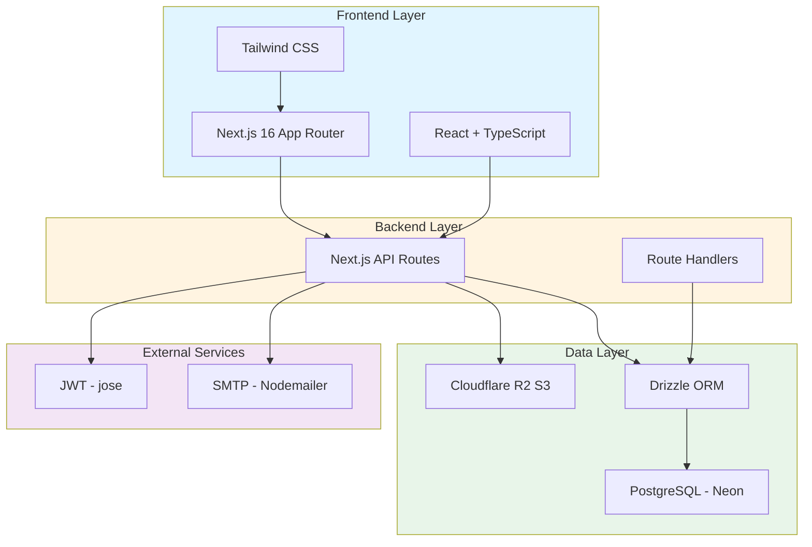

---

## 2. Backend Layered Architecture

```mermaid
graph TD
    Client[Client Request] --> Layer1

    subgraph Layer1["Layer 1: API Routes"]
        A1[app/api/**/route.ts]
        A2[Request Parsing]
        A3[Response Formatting]
        A4[Error Handling]
    end

    Layer1 --> Layer2

    subgraph Layer2["Layer 2: Middleware"]
        B1[verifyInstitutionAuth]
        B2[requireRole]
        B3[Session Cache]
        B4[Rate Limiting]
    end

    Layer2 --> Layer3

    subgraph Layer3["Layer 3: Controllers"]
        C1[Business Logic]
        C2[Input Validation]
        C3[Service Orchestration]
        C4[HttpError Throwing]
    end

    Layer3 --> Layer4

    subgraph Layer4["Layer 4: Repositories"]
        D1[Database Queries]
        D2[Drizzle ORM]
        D3[Data Mapping]
        D4[CRUD Operations]
    end

    Layer4 --> Layer5

    subgraph Layer5["Layer 5: Services"]
        E1[R2 Storage]
        E2[SMTP Email]
        E3[JWT Operations]
        E4[Session Cache]
    end

    Layer5 --> Database[(PostgreSQL<br/>Neon Serverless)]
    Layer5 --> Storage[(Cloudflare R2<br/>Storage)]

    style Layer1 fill:#ffebee
    style Layer2 fill:#fff3e0
    style Layer3 fill:#e8f5e9
    style Layer4 fill:#e3f2fd
    style Layer5 fill:#f3e5f5
    style Database fill:#c8e6c9
    style Storage fill:#b3e5fc
```

---

## 3. Database Entity Relationship Diagram

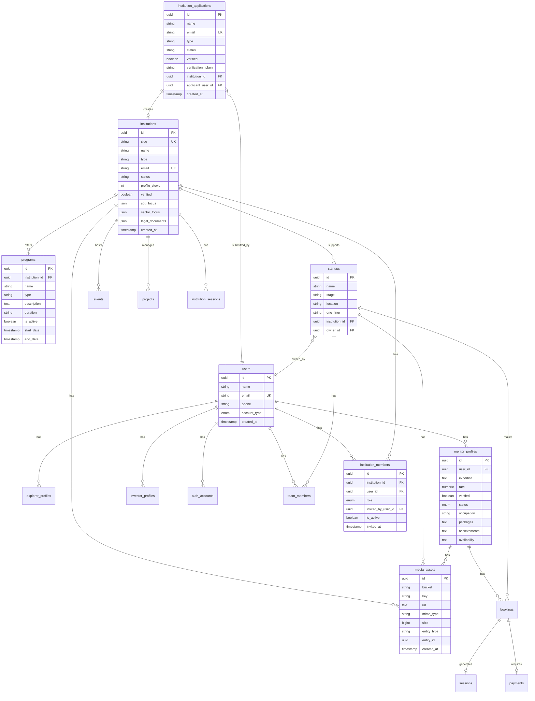

---

## 4. Institution Authentication Flow

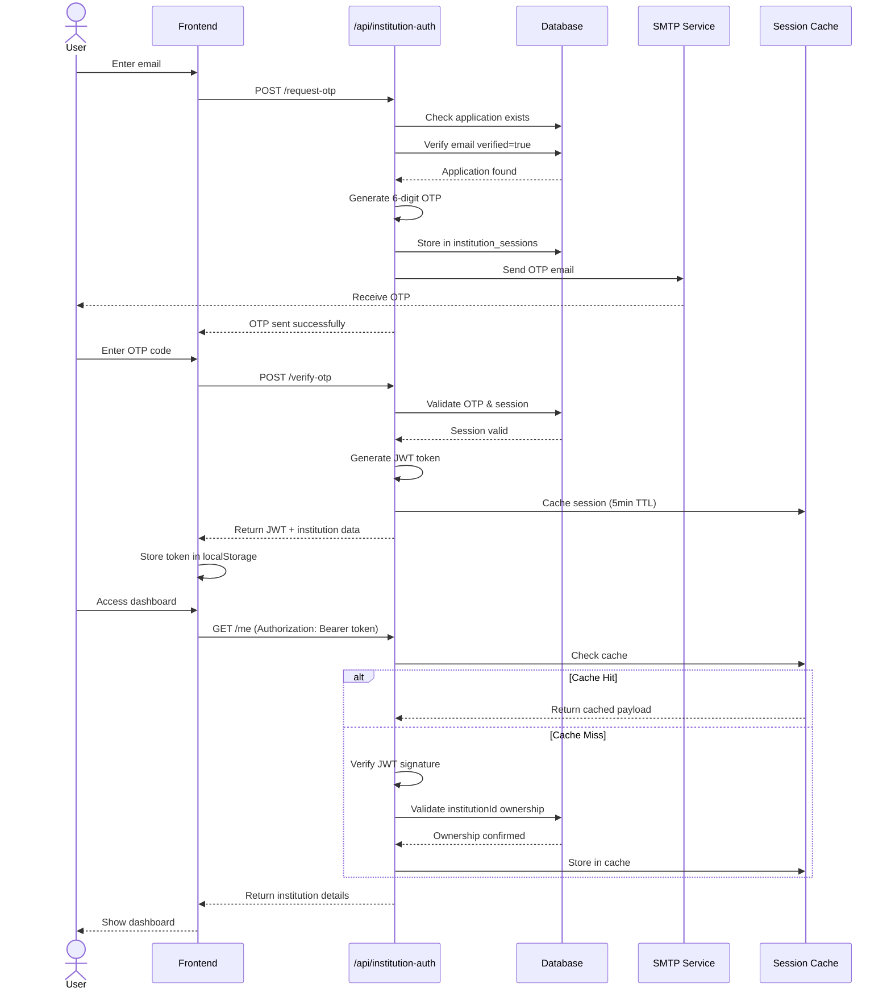

---

## 5. Role-Based Access Control (RBAC)

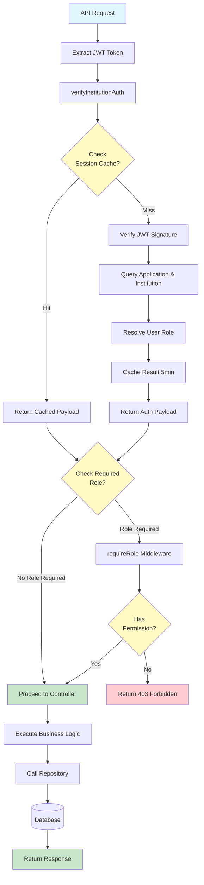

---

## 6. Data Flow: Create Program Example

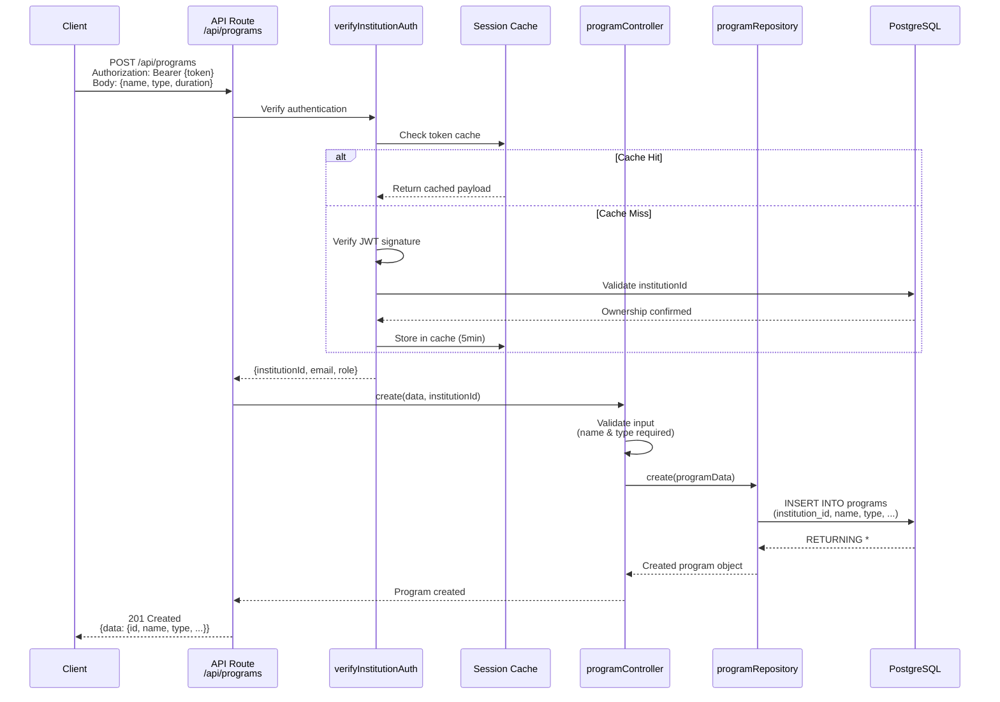

---

## 7. API Endpoint Structure

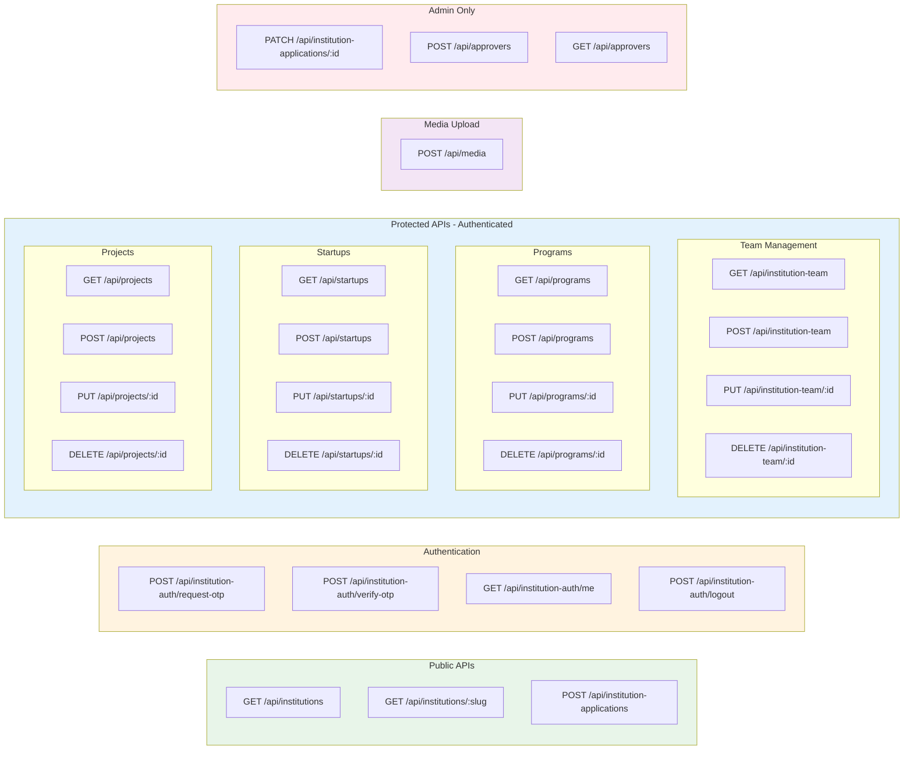

---

## 8. Institution Application Lifecycle

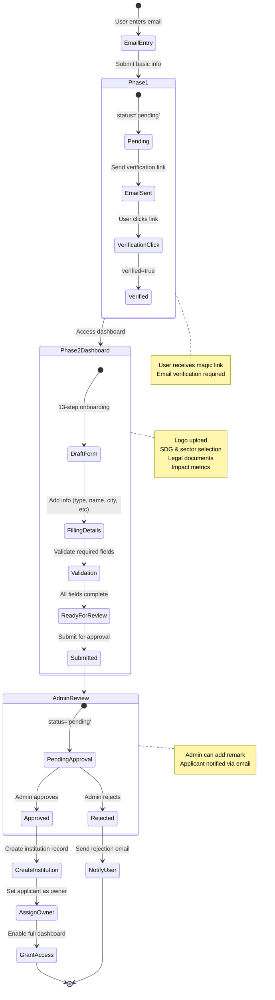

---

## 9. Directory Structure

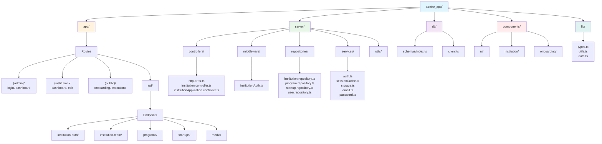

---

## 10. Security Layers

```mermaid
graph TB
    Request[Incoming Request] --> Layer1

    subgraph Layer1["1. Input Validation"]
        V1[Request Body Validation]
        V2[Type Checking]
        V3[Required Fields]
    end

    Layer1 --> Layer2

    subgraph Layer2["2. Authentication"]
        A1[JWT Token Verification]
        A2[Token Expiry Check]
        A3[Signature Validation]
    end

    Layer2 --> Layer3

    subgraph Layer3["3. Authorization"]
        Z1[Ownership Validation]
        Z2[Role-Based Access Control]
        Z3[Resource Permission Check]
    end

    Layer3 --> Layer4

    subgraph Layer4["4. Rate Limiting"]
        R1[IP-based Throttling]
        R2[OTP Request Limits]
        R3[API Quota Enforcement]
    end

    Layer4 --> Layer5

    subgraph Layer5["5. SQL Injection Prevention"]
        S1[Parameterized Queries]
        S2[Drizzle ORM]
        S3[No Raw SQL]
    end

    Layer5 --> Layer6

    subgraph Layer6["6. Session Security"]
        SS1[Session Cache Isolation]
        SS2[Token Hashing]
        SS3[5-minute TTL]
    end

    Layer6 --> Layer7

    subgraph Layer7["7. Media Upload Security"]
        M1[File Type Validation]
        M2[5MB Size Limit]
        M3[Random UUID Filenames]
        M4[Content-Type Checking]
    end

    Layer7 --> ProcessRequest[Process Request]
    ProcessRequest --> Response[Secure Response]

    style Layer1 fill:#ffebee
    style Layer2 fill:#fff3e0
    style Layer3 fill:#fff9c4
    style Layer4 fill:#f3e5f5
    style Layer5 fill:#e8f5e9
    style Layer6 fill:#e3f2fd
    style Layer7 fill:#fce4ec
    style ProcessRequest fill:#c8e6c9
    style Response fill:#c8e6c9
```

---

## 11. Mentor & Xplorer Ecosystem

```mermaid
graph TB
    subgraph Users["User Types"]
        Explorer[Explorer/Xplorer<br/>Students/Entrepreneurs]
        Mentor[Mentor/Coach<br/>Industry Experts]
        Startup[Startup Team<br/>Founders]
        Institution[Institution<br/>Incubators/Accelerators]
        Investor[Investor<br/>VCs/Angels]
    end

    Explorer -->|Signs up| ExplorerFlow
    Mentor -->|Applies| MentorFlow
    Startup -->|Joins| StartupFlow
    Institution -->|Onboards| InstitutionFlow

    subgraph ExplorerFlow["Explorer Journey"]
        E1[Signup: Name, Email, Password]
        E2[Select Interests up to 15]
        E3[Google OAuth Option]
        E4[Browse Institutions]
        E5[Book Mentor Sessions]
        E6[Join Programs]
    end

    subgraph MentorFlow["Mentor Journey"]
        M1[Apply as Mentor]
        M2[status='pending']
        M3[Admin Approval]
        M4[status='approved']
        M5[Setup Packages & Pricing]
        M6[Set Availability]
        M7[Accept Bookings]
    end

    subgraph StartupFlow["Startup Journey"]
        S1[Added by Institution]
        S2[Team Members Invited]
        S3[Profile Creation]
        S4[Access Mentor Network]
        S5[Apply to Programs]
    end

    subgraph InstitutionFlow["Institution Journey"]
        I1[Submit Application]
        I2[Email Verification]
        I3[Complete Onboarding]
        I4[Admin Approval]
        I5[Publish Profile]
        I6[Add Programs]
        I7[Manage Startups]
        I8[Host Events]
    end

    E1 --> E2
    E2 --> E3
    E3 --> E4
    E4 --> E5
    E5 --> E6

    M1 --> M2
    M2 --> M3
    M3 --> M4
    M4 --> M5
    M5 --> M6
    M6 --> M7

    S1 --> S2
    S2 --> S3
    S3 --> S4
    S4 --> S5

    I1 --> I2
    I2 --> I3
    I3 --> I4
    I4 --> I5
    I5 --> I6
    I6 --> I7
    I7 --> I8

    style Users fill:#e1f5ff
    style ExplorerFlow fill:#e8f5e9
    style MentorFlow fill:#fff3e0
    style StartupFlow fill:#f3e5f5
    style InstitutionFlow fill:#e3f2fd
```

---

## 12. Performance Optimization Strategy

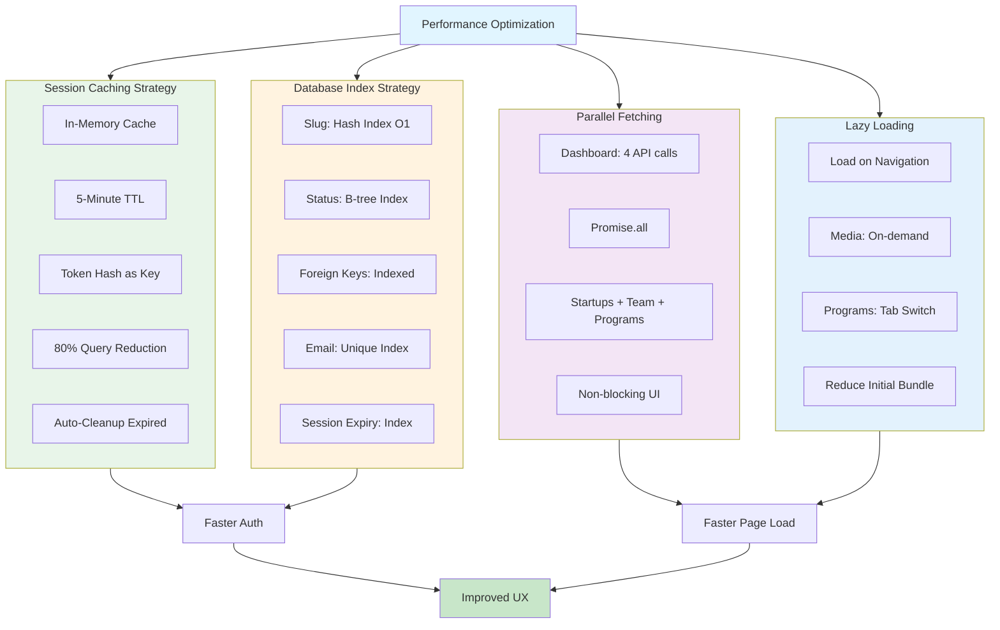

---

## 13. Deployment Architecture

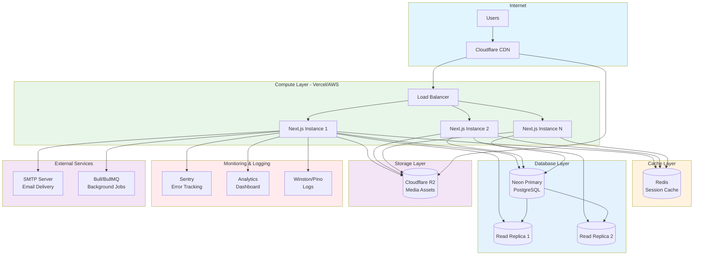

---

## How to Use These Diagrams

### ⚠️ Important: Copy Individual Diagrams Only

Each diagram in this document is wrapped in triple backticks with `mermaid` syntax. **Do not copy the entire file** into a Mermaid renderer.

### Viewing Options

**Option 1: GitHub (Recommended)**

- Push this file to GitHub
- View directly in the repository (GitHub renders Mermaid automatically)
- No additional setup required

**Option 2: VS Code**

- Install "Markdown Preview Mermaid Support" extension
- Open this file and click "Preview" (Cmd+Shift+V on Mac)

**Option 3: Mermaid Live Editor**

1. Go to [mermaid.live](https://mermaid.live)
2. **Copy only the code between the triple backticks** from one diagram section
3. Paste into the editor (left panel)
4. View rendered diagram (right panel)

**Example - Copy this code only:**

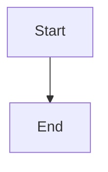

**Do NOT copy:**

### Customization

- Modify colors using `style` directives
- Change layout direction: `TB` (top-bottom), `LR` (left-right)
- Add/remove nodes and connections as needed

## Legend

- **Blue boxes**: Frontend/Client layer
- **Green boxes**: Backend/Server layer
- **Yellow boxes**: Decision points/Cache
- **Purple boxes**: External services
- **Red boxes**: Error states
- **Cylinders**: Databases/Storage

---

## Generated for Xentro Backend Architecture Documentation
